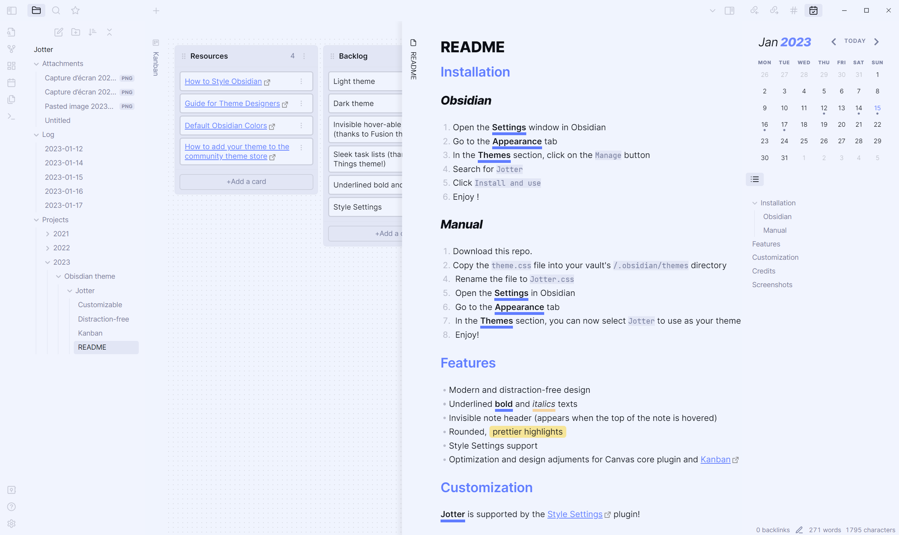
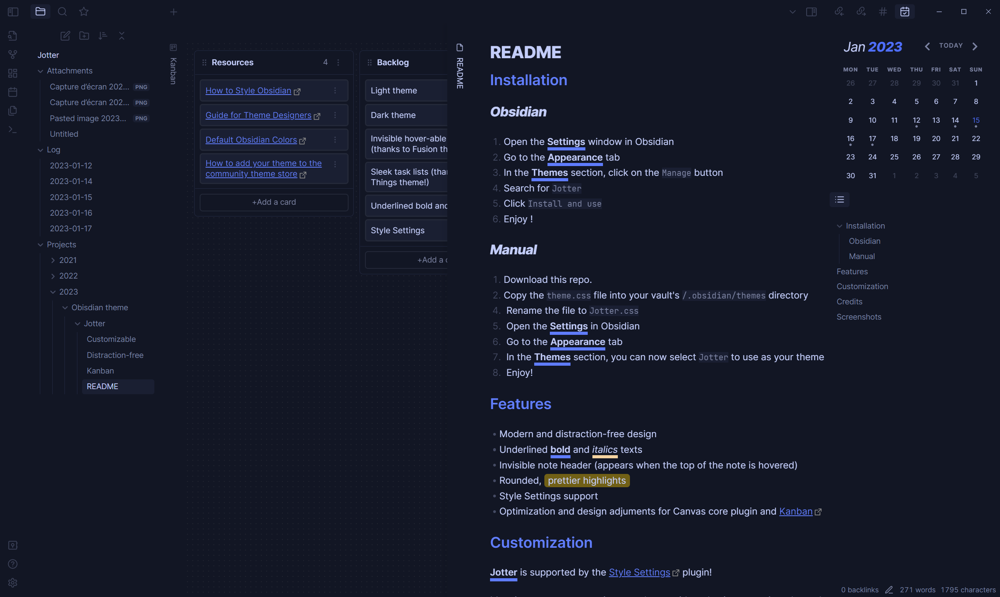

## Installation

### Obsidian

1. Open the **Settings** window in Obsidian
2. Go to the **Appearance** tab
3. In the **Themes** section, click on the `Manage` button
4. Search for `Jotter`
5. Click `Install and use`
6. Enjoy ! 

### Manual

1. Download this repo.
2. Copy the `theme.css` file into your vault's `/.obsidian/themes` directory
4.  Rename the file to `Jotter.css` 
5.  Open the **Settings** in Obsidian
6.  Go to the **Appearance** tab
7.  In the **Themes** section, you can now select `Jotter` to use as your theme!
8.  Enjoy!

## Features

- Modern and distraction-free design
- Underlined **bold** and *italics* texts
- Invisible note header (appears when the top of the note is hovered)
- Rounded, prettier highlights
- Style Settings support
- Optimization and design adjuments for Canvas core plugin and [Kanban](https://github.com/mgmeyers/obsidian-kanban) plugin

## Customization

**Jotter** is supported by the [Style Settings](https://github.com/mgmeyers/obsidian-style-settings) plugin!

Meaning, you can customize your theme without having to get into the code part.

- Change headings colors
- Toggle heading styles (underlines, italics) for H2s and H3s
- Disable bold and italic texts underlines
- Change bold and italic underline colors
- Change bold and italic text colors

*Download Style Settings through the Community Plugins page in Obsidian to start customizing Jotter theme!*

I will try to include more customization options in the future, so keep an eye out for updates!

## Credits

Inspired by:
- [Things](https://github.com/colineckert/obsidian-things)
- [Fusion](https://github.com/zamsyt/obsidian-fusion)
Go check out their work and support them!

## Screenshots

