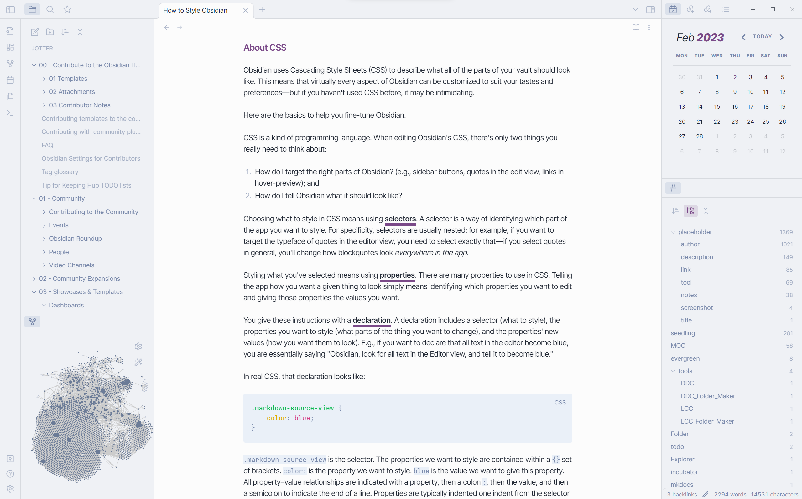

## Installation

### Obsidian

1. Open the **Settings** window in Obsidian
2. Go to the **Appearance** tab
3. In the **Themes** section, click on the `Manage` button
4. Search for `Jotter`
5. Click `Install and use`
6. Enjoy ! 

### Manual

1. Download this repo.
2. Copy the `theme.css` file into your vault's `/.obsidian/themes` directory
4.  Rename the file to `Jotter.css` 
5.  Open the **Settings** in Obsidian
6.  Go to the **Appearance** tab
7.  In the **Themes** section, you can now select `Jotter` to use as your theme!
8.  Enjoy!

## Features

- Modern and distraction-free design
- Underlined **bold** and *italics* texts
- Invisible note header (appears when the top of the note is hovered)
- Rounded highlights
- Style Settings support
- Optimization and design adjustments for Canvas core plugin and [Kanban](https://github.com/mgmeyers/obsidian-kanban) plugin

## Customization

**Jotter** is supported by the [Style Settings](https://github.com/mgmeyers/obsidian-style-settings) plugin!

Meaning, you can customize your theme without having to get into the code part.

- 5 color themes to choose from
- 12 predefined accent colors and the ability to disable those predefined colors to choose your own
- Borderless interface
- Wrap file and folder titles in the explorer
- Change headings colors
- Toggle heading styles (underlines, italics) for H2s and H3s
- Change bold and italic text colors
- Change bold and italic underline colors
- Disable bold and italic texts underlines

*Download Style Settings through the Community Plugins page in Obsidian to start customizing Jotter theme!*

I will try to include more customization options in the future, so keep an eye out for updates!

## Color Themes and Accent Colors

Some screenshots to showcase every theme and accent colors.
Pick and match as you please!

### Jotter

*Light theme + Ultramarine accent*

*Dark theme + Pumpkin accent*

### Reporter

*Light theme + Jade accent*

*Dark theme + Mustard accent*

### Explorer

*Light theme + Wine accent*

*Dark theme + Turquoise accent*

### Keeper

*Light theme + Denim accent*

*Dark theme + Slate accent*

### Undercover

*Light theme + Mauve accent*

*Dark theme + Bubblegum accent*

## Credits

Inspired by:

- [Things](https://github.com/colineckert/obsidian-things) - @colineckert
- [Fusion](https://github.com/zamsyt/obsidian-fusion) - @zamsyt
- [Sanctum]( https://github.com/jdanielmourao/obsidian-sanctum) - @jdanielmourao
- [Yin and Yang](https://github.com/chetachiezikeuzor/Yin-and-Yang-Theme) - @chetachiezikeuzor
- [Golden Topaz](https://github.com/shaggyfeng/obsidian-Golden-Topaz-theme) - @shaggyfeng

Go check out everyone’s work and support them!

## Changelog

#### v.0.2.0

Added the `Interface` menu in Style Settings.
New option to pick between bordered and borderless styles on the interface.

#### v.1.0.0

Big update for Jotter!

Additions to the Style Settings plugin:
- 5 additional color themes (including the Obsidian default theme)
- 12 predefined accent colors, and the ability to still color-pick your own accent color
- Display full file and folder titles in the explorer

Improvements:
- Calendar
- Default bold underline color is now set to the accent color
- Kanban checkboxes
- Code refractor

#### v.1.1.0

French translation added to Style Settings.

#### v.1.2.1

Obsidian default color theme removed temporarily.
Fixed default color theme when Jotter is loaded without Style Settings.

#### v.1.23.0

Additions to the Style Settings plugin:
- Colorful tooltips
- Adjust headings sizes
- Active line highlight

Improvements:
- Fix text on accent for predefined "Bubblegum", "Turquoise", "Mustard", and "Pumpkin" colors
- Fix active navigation item color on dark color themes (used to pick the same background color as the "Jotter" color theme)