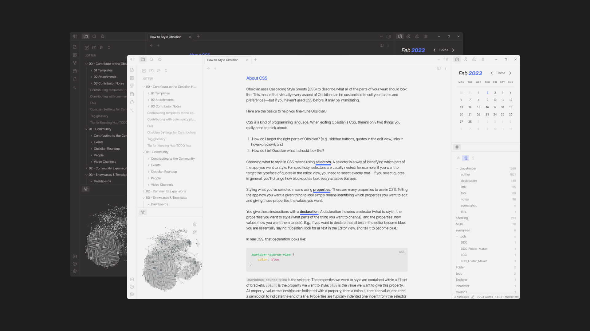

## Installation

### Obsidian

1. Open the **Settings** window in Obsidian
2. Go to the **Appearance** tab
3. In the **Themes** section, click on the `Manage` button
4. Search for `Jotter`
5. Click `Install and use`
6. Enjoy ! 

### Manual

1. Download this repo.
2. Copy the `theme.css` file into your vault's `/.obsidian/themes` directory
4.  Rename the file to `Jotter.css` 
5.  Open the **Settings** in Obsidian
6.  Go to the **Appearance** tab
7.  In the **Themes** section, you can now select `Jotter` to use as your theme!
8.  Enjoy!

## Features

- Style Settings support
- Optimization and design adjustments for Canvas core plugin, [Kanban](https://github.com/mgmeyers/obsidian-kanban), [Calendar](https://github.com/liamcain/obsidian-calendar-plugin) and [Dataview](https://github.com/blacksmithgu/obsidian-dataview) community plugins

## Customization

**Jotter** is supported by the [Style Settings](https://github.com/mgmeyers/obsidian-style-settings) plugin!

Meaning, you can customize your theme without having to get into the code part.

- 6 color themes
- 13 predefined accent colors
- Borderless interface
- Wrap file and folder titles in the explorer
- Hide note title in text editor
- Change headings colors
- Toggle heading styles (underlines, italics) for H2s, H3s, H5s and H6s
- Change bold and italic text colors
- Change bold and italic underline colors
- Toggle bold and italic texts underlines

*Download Style Settings through the Community Plugins page in Obsidian to start customizing Jotter theme!*

I will try to include more customization options in the future, so keep an eye out for updates!

## Color Themes and Accent Colors

Some screenshots to showcase additional color themes and predefined accent colors.
Pick and match as you please!

### Jotter

*Light theme + Ultramarine accent*

*Dark theme + Rust accent*

### Reporter

*Light theme + Pumpkin accent*

*Dark theme + Mustard accent*

### Explorer

*Light theme + Denim accent*

*Dark theme + Jade accent*

### Keeper

*Light theme + Slate accent*

*Dark theme + Turquoise accent*

### Undercover

*Light theme + Mauve accent*

*Dark theme + Bubblegum accent*

## Credits

Inspired by:

- [Things](https://github.com/colineckert/obsidian-things) - @colineckert
- [Fusion](https://github.com/zamsyt/obsidian-fusion) - @zamsyt
- [Sanctum]( https://github.com/jdanielmourao/obsidian-sanctum) - @jdanielmourao
- [Yin and Yang](https://github.com/chetachiezikeuzor/Yin-and-Yang-Theme) - @chetachiezikeuzor
- [Golden Topaz](https://github.com/shaggyfeng/obsidian-Golden-Topaz-theme) - @shaggyfeng
- [Minimal](https://github.com/kepano/obsidian-minimal) - @kepano

Go check out everyone’s work and support them!

## Changelog

#### v.0.2.0

Added the `Interface` menu in Style Settings.
New option to pick between bordered and borderless styles on the interface.

#### v.1.0.0

Big update for Jotter!

Additions to the Style Settings plugin:
- 5 additional color themes (including the Obsidian default theme)
- 12 predefined accent colors, and the ability to still color-pick your own accent color
- Display full file and folder titles in the explorer

Improvements:
- Calendar
- Default bold underline color is now set to the accent color
- Kanban checkboxes
- Code refractor

#### v.1.1.0

French translation added to Style Settings.

#### v.1.2.1

Obsidian default color theme removed temporarily.
Fixed default color theme when Jotter is loaded without Style Settings.

#### v.1.23.0

Additions to the Style Settings plugin:
- Colorful tooltips
- Adjust headings sizes
- Active line highlight

Improvements:
- Fix text on accent for predefined "Bubblegum", "Turquoise", "Mustard", and "Pumpkin" colors
- Fix active navigation item color on dark color themes (used to pick the same background color as the "Jotter" color theme)

#### v. 1.3.0

*Style Settings plugin:*

- New "Editor" section where the active line highlight option has been moved
	- Added the "Hide note title" option, to hide the note title in the text editor
- "Brick" accent color has been renamed to "Vermilion"
- New "Rust" accent color
- New style on H5s and H6s (uppercase) + option to disable said styling
- Obsidian default color theme has been re-added

*General improvements:*

- Interface
	- File Explorer
		- Lighter file names / Darker folder names
		- Spacing between files
		- Uppercase, smaller vault name
		- Padding adjustments
	- Side dock
	- Header
		-  Re-added file name to the note header, which now is the only hover-able element of the header 
	- Removed unnecessary padding from hidden vault name (with [Hider](https://github.com/kepano/obsidian-hider) plugin)
	- Changed headings default sizes (smaller)
- Calendar 
	- Added padding and bottom border on days of the week
- Small color adjustments on additional color themes
- Adjustments on predefined color accents 
	- Added hsl values to avoid default accent color to pick through when dragging files or on text selection
- Adjustments on rgb colors (code, canvas, callouts) on certain color themes
- PDF export 
	- Fixed light colored text exports when in dark mode

#### v. 1.3.1

Patch on inline code pdf exports.

#### v. 1.31.0

Improvements on Dataview table styling